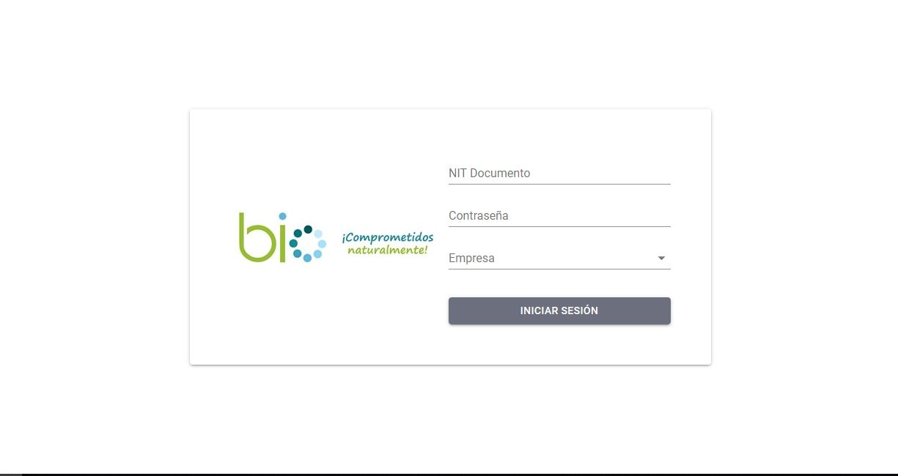
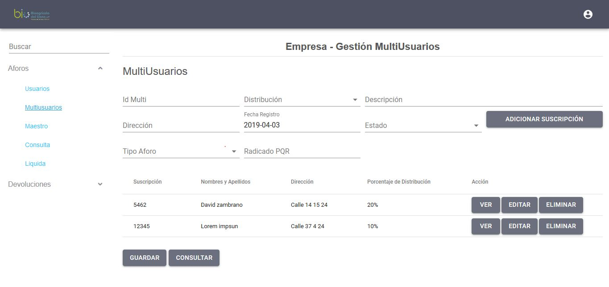

# PORTAFOLIO (en progreso)

## Proyectos

### Taras

Sistema que permite calcular tarifas de aseo 

 
  
  
  
  
  

### SANO & NATURAL

Sistema intranet para la gestión de historías clinicas de pacientes, facturación e inventario.

### FACTSISOFT NÓMINA

Módulo para la gestión de nóminas de entidades públicas y privadas.

### UPME

Sistema para el control de precios de gasolina estaciones de servicio.

