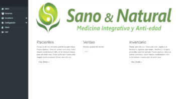
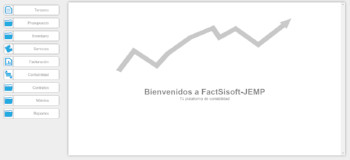
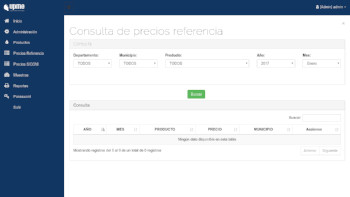

# PORTAFOLIO

## Proyectos

### SANO & NATURAL

Sistema intranet para la gestión de historías clinicas de pacientes, facturación e inventario.

### FACTSISOFT NÓMINA

Módulo para la gestión de nóminas de entidades públicas y privadas.

<video width="640" height="360" id="player1" preload="true">
    <source type="video/youtube" src="http://www.youtube.com/watch?v=nOEw9iiopwI" />
</video>
sss
<iframe width="420" height="345"
src="http://www.youtube.com/embed/XGSy3_Czz8k">
</iframe>
### UPME

Sistema para el control de precios de gasolina estaciones de servicio.

